# Music App

### Our app is a music-focused application that allows users to explore tracks and albums, manage playlists, and engage in quizzes.

# Search Screen

    1. Features
    A search bar for entering queries.
    Option to filter search results by tracks or albums.

### Search by tracks or albums

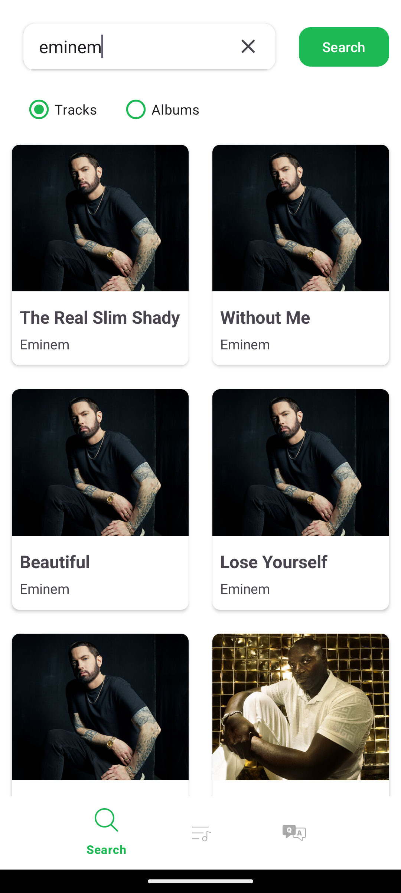 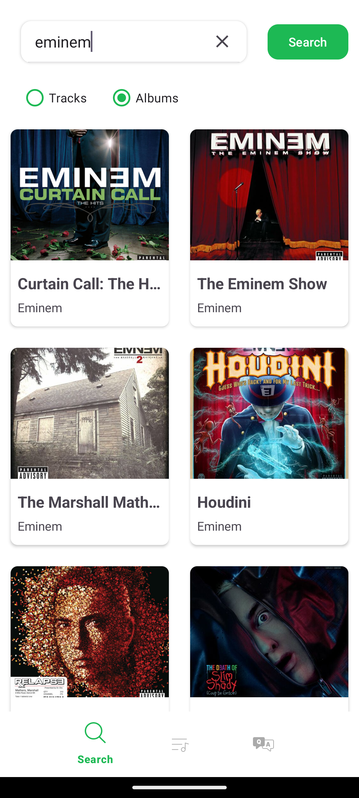

    2. Results:
    Results are shown in a scrollable grid format using a RecyclerView.
    Each result displays the album cover, album/track title, and artist name.

    3. Interactions:
    Clicking on an item navigates to the Details screen to show detailed information.
    Long-pressing an item adds it to the desired playlist.

### Long-pressing an item

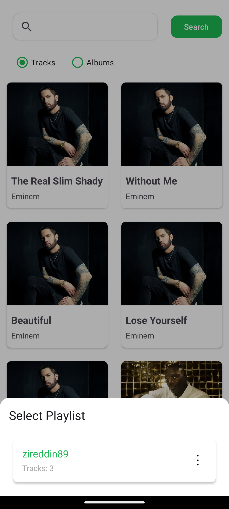

## Details Screen

* Displays detailed information about a selected track or album.
* For tracks, includes a button to play a short preview of the track.
* For albums, enter the playlist and show all songs in album.

### Track Details_____________ Album Details__________

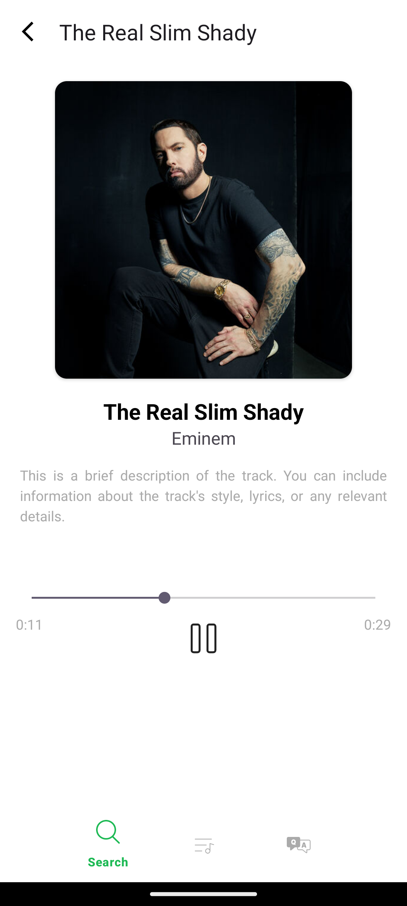 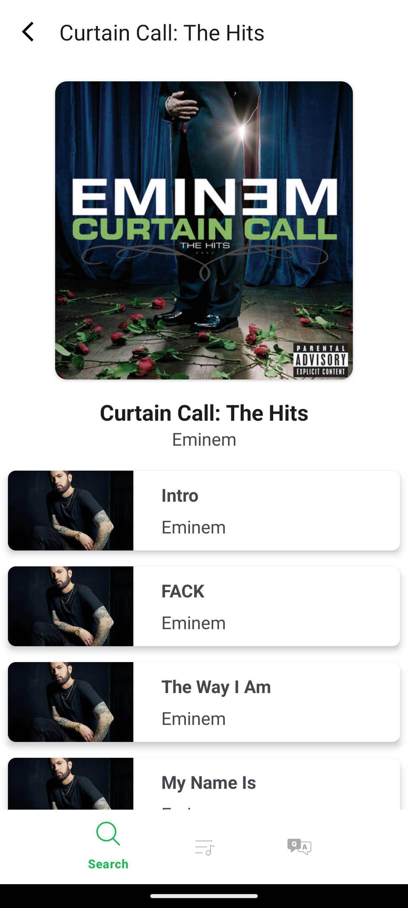

# Playlist Screen

* #### Allows users to list, create, and manage local playlists.

### Creation of Playlist________  Adding new Playlist

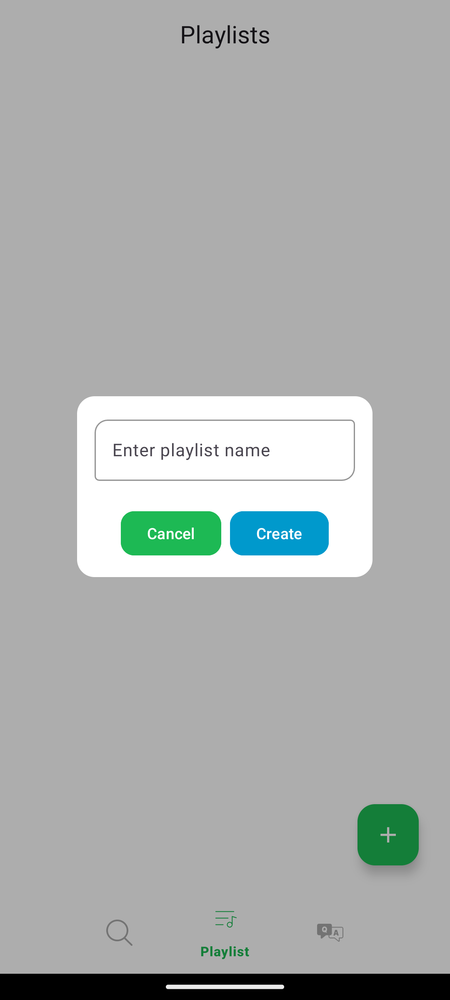 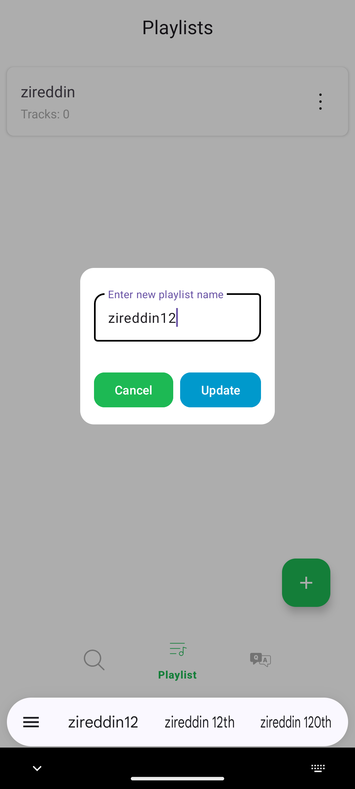 

* #### Users Delete and Edit playlists whenever they want.

### Edit and Delete section____ Delete Playlist

 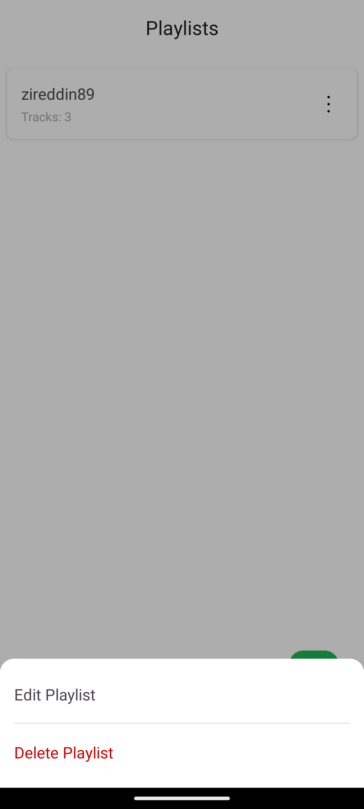 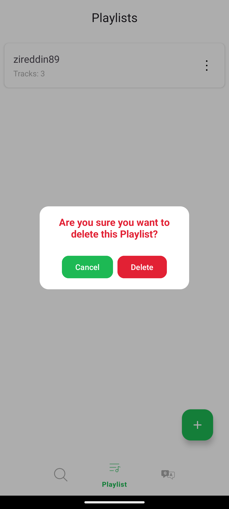 

* #### Each playlist consists of multiple tracks stored locally in the app's database.

### Inside of Playlist

 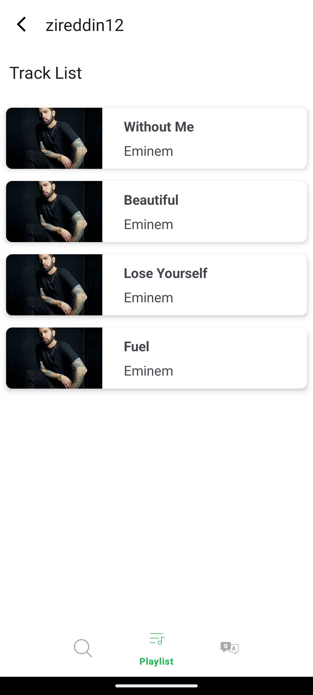

# Quiz Screen

* #### Enables users to create, view, and manage quizzes linked to playlists. Users enter quiz name select which playlist they use, number of questions and time limit.
    1. Quiz name
    2. Associated playlist name
    3. Number of questions
    4. Time limit(seconds)
    5. "Create Quiz" button to create quiz

### Creation of Quiz

 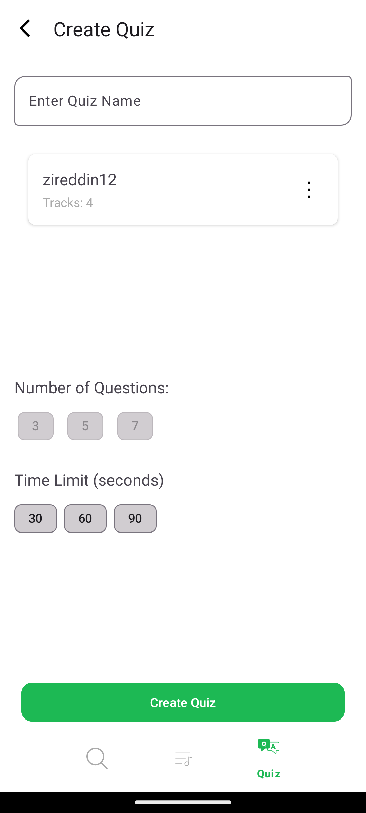 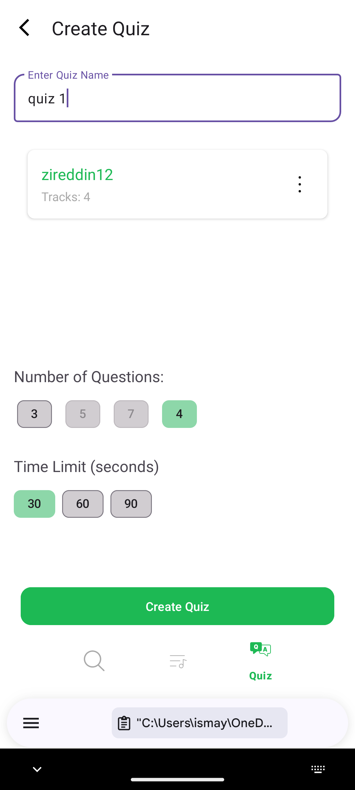  

* #### Users can edit playlist name and delete it whenever they want. Additionally, when they click to quiz they see associated playlist and "start quiz" button

### Edit and Delete quiz______ Start Quiz

 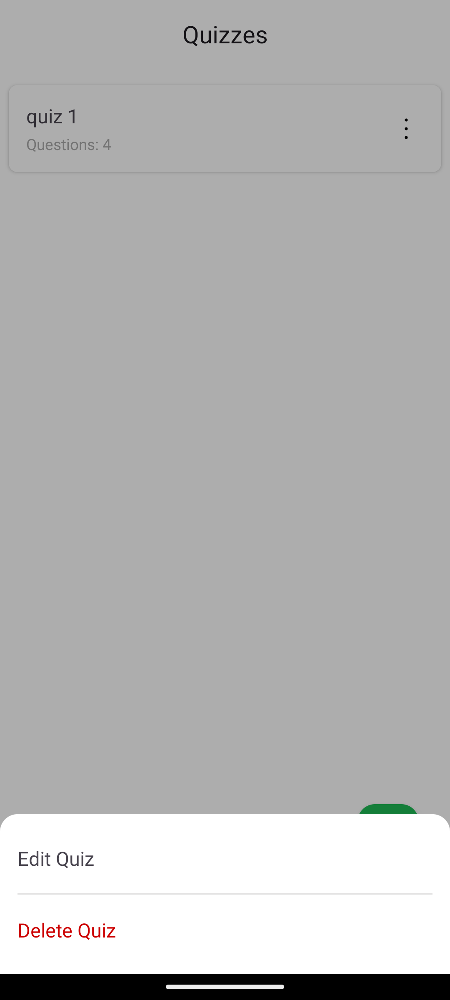 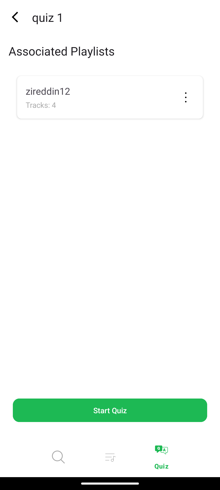  

* #### Quiz Gameplay
    * A preview of the track is played for each question.
    * Users select among multiple-choice answers.
    * Time limit set for each question
    * Check Answer and show correct and wrong answers in green and red respectively

### Quiz Game

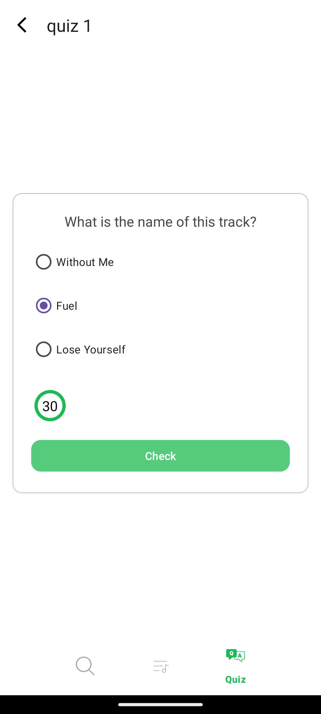
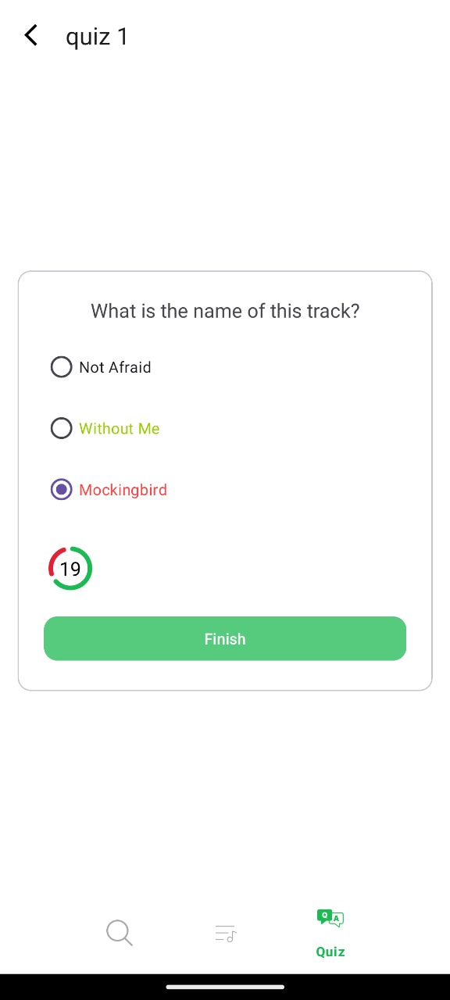 

# Second Section: App Architecture and Implementation Choices

Our project follows the Model-View-ViewModel (MVVM) architecture to ensure scalability,
maintainability, and separation of concerns.

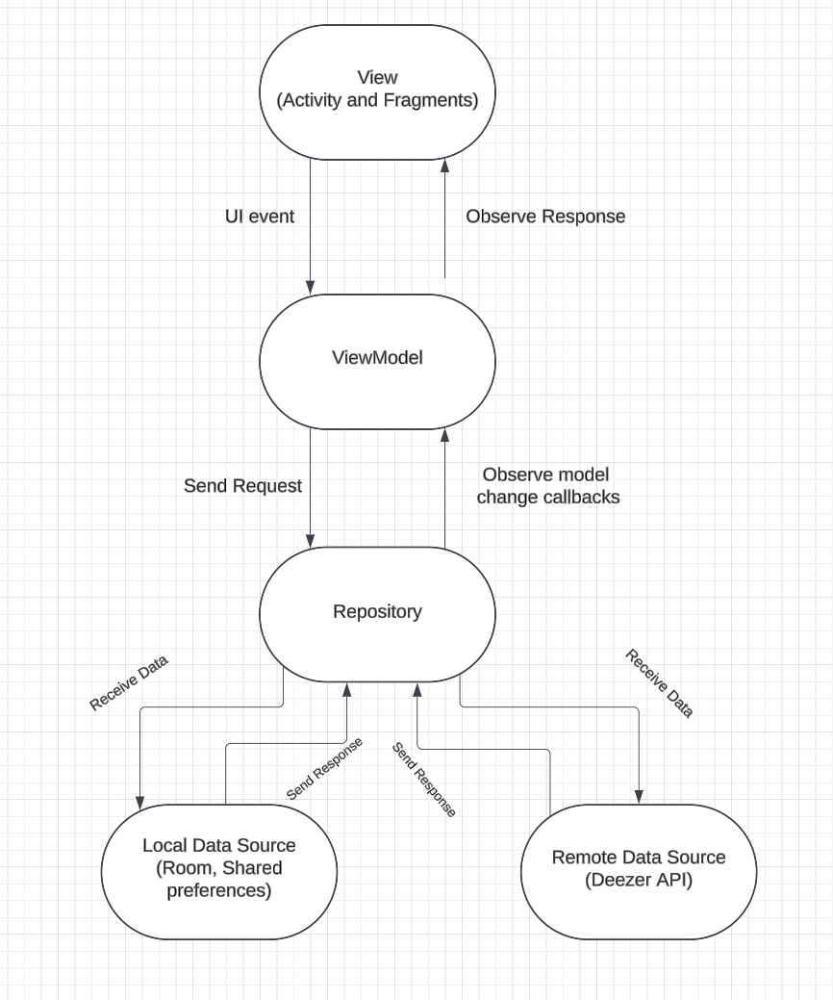 

## Implementation Choices

1. Navigation and UI Components
    * We implemented a single NavGraph to define navigation between fragments.
    * SafeArgs is used for type-safe argument passing between fragments.
2. View Layer
    * Fragments:
        * Each core functionality is implemented as a separate fragment, making the UI modular and
          easy to manage. We have 4 fragments: SearchFragment, TrackDetailsFragment,
          PlaylistFragment,QuizFragment
    * RecyclerView Adapters:
        * GridRVAdapter.kt: Displays search results in a grid format.
        * TrackRVAdapter.kt: Displays tracks in the album details screen.
    * ExoPlayer and Glide:
        * ExoPlayer: Handles track previews for details and quiz screens.
        * Glide: Efficiently loads album and track images.
3. ViewModel Layer
    * ViewModels:
        * Each screen with dynamic data uses a dedicated ViewModel for state management:
          SearchViewModel, PlaylistViewModel, QuizViewModel
    * LiveData:
        * LiveData is used for observing UI state and updating it reactively.
4. Model Layer
    * Room Database:
        * Used for storing playlists and quizzes locally.
            * Entities: PlaylistEntity and QuizEntity.
            * DAO: PlaylistDao and QuizDao.
    * Repository Pattern:
        * DeezerRepository: Fetches data from the Deezer API.
        * MusicRepository: Manages local playlist data, handles quiz-related data.
5. Third-Party Libraries:
    * Retrofit:
        * Used for connecting to the Deezer API and fetching tracks and albums.
        * API integration is encapsulated within DeezerRepository.kt.
    * Glide:
        * For efficient image loading and caching.
    * ExoPlayer:
        * Handles music preview playback.

## Work Contribution

We both work project to enhance it and make it works perfect. We collaborate together and do all
these tasks.

Commits for Music App project

* Ziraddin Ismayilov:
    1. Initial Commit
        * Bottom navigation bar,navigation graph, project folder structure.
    2. Adapters Added:
        * Search Results Grid (`GridRVAdapter.kt`)
        * Albums Track List (`TrackRVAdapter.kt`)
    3. UI Modifications:
        * Minor UI changes in `MainActivity`.
    4. Retrofit Integration:
        * Added API connection for fetching albums and tracks.
        * Implemented `DeezerRepository.kt` and API service.
    5. Music Controller and Media Handling:
        * Added music controller using ExoPlayer for track previews.
        * Integrated Glide for loading track and album images.
        * Minor UI improvements.
    6. Room Database and ViewModel Configuration:
        * Integrated Room Database for local storage.
        * Configured `QuizViewModel` and `PlaylistViewModel` with local database support.
        * Resolved bugs and applied minor UI updates.
* Rashad Mammadov:
    1. UI Created:
        * Search Screen
        * Track Details Screen (`TrackDetailsFragment.kt`)
        * Album Details Screen (`AlbumDetailsFragment.kt`)
    2. NavGraph Updates:
        * Added SafeArgs and actions between fragments.
        * Applied page transition animations.
    3. Playlist Management:
        * Developed Playlist UI and management functions.
    4. Quiz Setup:
        * Added functionality to add tracks to custom playlists.
        * Created initial Quiz, CreateQuiz, and Quiz Details screens with navigation and SafeArgs.
    5. Quiz Screens Expansion:
        * Added Quiz Details,
        * Create Quiz,
        * Quiz Challenge screens.

# Third Section: Technical problems

    We tested all functionalities and found no issues; the project works very well.
    
